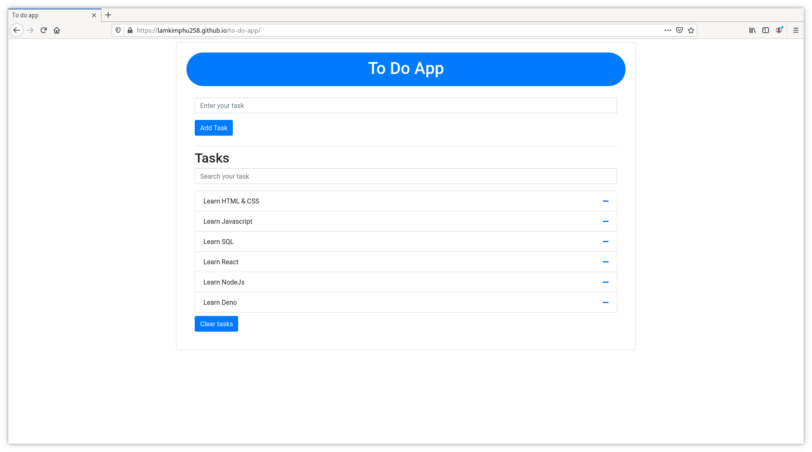

# To do app
As you can see, in this app you can type a name of your task and add it and you see your task below. You also can search for the task you need. At the right of each task, a minus icon is used to delete that task. A clear task button will help you to clear all task you have once.

 

# How To Run
1. `git clone https://github.com/lamkimphu258/to-do-app`
2. `cd to-do-app`
3. `chmod +x run.sh`
4. `./run.sh`

# Online Website
https://lamkimphu258.github.io/to-do-app/